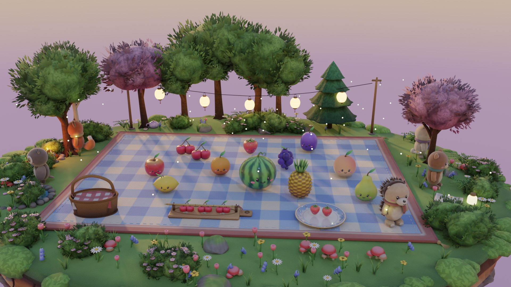
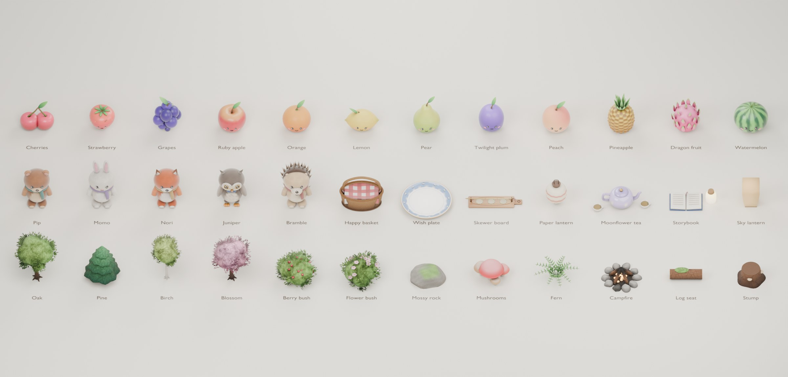

# The Lantern Picnic · Little Keepsakes



A storybook fruit-merge picnic on a floating forest island. Grandma Hazel, the Lantern Keeper, has left Pip a letter: light the clearing's five lanterns on Lantern Night, one for every friend who finds their way there, and she will see them from wherever she is.

Five toy friends arrive over one evening, from a sunny afternoon to a night-time lantern festival. Each brings a wish and a piece of the mystery: why the lanterns went dark, and where Hazel went. Merge fruit on the gingham blanket, serve each friend's wish, thread a bamboo skewer, and light a lantern for everyone who joins you. The story is in [docs/STORY.md](docs/STORY.md).

Every model, texture, animation, icon and sound is original. Assets are generated by Python in Blender 4.5 LTS. Phones, tablets and modest computers play on a **light stage**: the 3D clearing pre-rendered into 2.5D art and drawn with the browser's plain 2D canvas, so it opens fast and runs smoothly. Capable computers get the full Three.js renderer. **Graphics: Automatic** in Settings makes that choice per device, and either renderer can be picked by hand.

The Lantern Trail, a small 2.5D RPG with these friends, now lives in its own repository: [game_RPG](https://github.com/buicongnguyen/game_RPG) (play it at https://buicongnguyen.github.io/game_RPG/).

## Play

```sh
npm install
npm run dev          # http://localhost:4173
npm run dev:mobile   # phone on the same Wi-Fi (the terminal prints the address)
```

Drag matching fruit together to merge. Drop wished-for fruit on the plate and thread three of the pictured fruit onto the skewer. Some guests keep a wish secret or ask in riddles, and a good guess delights them.

Every three actions, the basket delivers fresh fruit by itself. Tapping it brings fruit right away, and that tap counts as an action. Rearranging is free, undo restores a whole action, and there are no timers and no way to lose. Finish at or under par for three stars and one of Hazel's recipe cards.

**Languages:** choose **English** or **Tiếng Việt** on the title screen or in Settings. The choice is remembered on this browser. All five invitations, letters, riddles, hints, rewards and controls are translated; changing language preserves progress and Undo. Earlier modes remain in English.

During conversations, click, Enter or Space advances, and Escape skips the scene.

Keyboard: **N** select · **arrows** move · **Enter** place · **T** serve · **K** thread · **B** basket · **U** undo · **Esc** cancel.

Useful URLs: `?play` skips the title and cinematics, `?quality=2d` forces the light stage, `?quality=low|medium|high|ultra` a 3D tier, `?quality=auto` the per-device choice, and `?debug` exposes `window.__lantern` for tests.

## What 1.0 changes

The previous version was a three-invitation vertical slice on a flat, orthographic board. 1.0 redesigns the presentation, feel and structure. [docs/AAA-REDESIGN.md](docs/AAA-REDESIGN.md) has the full rationale.

| Area | 1.0 |
| --- | --- |
| **World** | A floating diorama island with a layered earth cross-section, hanging roots and a grassy rim. Wind-swept instanced grass, four tree species, bushes, rocks, flowers, a lily pond, a campfire, lantern posts and stepping stones. Everything is snapped to the terrain. |
| **Time of day** | Each invitation happens later in the evening: afternoon, golden hour, sunset, dusk, night. Sky, sun, fog, reflections, color grade, fireflies and music crossfade between them. |
| **Rendering** | Physically based sheen/clearcoat materials with tileable detail maps, painted vertex color × ray-traced AO, soft shadows, bloom, MSAA, tilt-shift miniature focus, grading, vignette and grain. GTAO is enabled on Ultra. There are four quality tiers plus adaptive resolution. |
| **Characters** | Five rigged toy friends (Pip the bear, Momo the bunny, Nori the fox, and new friends Juniper the owl and Bramble the hedgehog). Each has 7 animation clips, blinking, head tracking of the fruit you hold, walk-ins along a path, reactions and babbling voices. |
| **Feel** | Springs with squash and stretch, a pendulum lean while dragging, excited matching fruit, arcing merges/servings/deliveries, a hit-stop and camera shake on chains, sparkle rings, confetti and rising motes. |
| **Story (1.1)** | Hazel's letters open and close the evening. Each invitation has a framed arrival scene and an outro, with friends' barks during play. Wishes can be secret, riddles or whispered. Bramble's lantern leads the festival, the far islands answer, and the Journey keeps memories and recipe cards. |
| **Light stage (1.3)** | Phones, tablets and modest computers play on a pre-rendered 2.5D stage. It has five baked hours per screen shape, weaves the chosen blanket in at load, and draws fruit, friends and lanterns as sprite atlases on the bake camera's exact projection. It needs no WebGL and never downloads Three.js or the 5 MB of models: 2.0 MB and 1.5 s to the title on a phone, where 1.2 took 7.2 MB and 6.4 s. Capable computers keep 3D. See [docs/LIGHT-STAGE.md](docs/LIGHT-STAGE.md). |
| **Game UI and shop (1.2)** | Blender-rendered toy icons, menu tiles, bottom-sheet dialogs on phones, grouped settings with real switches, and 44–48 px touch targets throughout. **Hazel's Trunk** spends golden joys on blankets and lantern colours that dress the 3D picnic. See [docs/UI.md](docs/UI.md). |
| **Structure** | A title screen, letterboxed chapter intros with typewriter dialogue, lantern-lighting celebrations with a camera push-in, star ratings, a night festival finale with sky lanterns and fireworks, a journey screen and revisits, settings, gentle idle hints, and v1-save migration. |
| **Audio** | A procedural Web Audio engine: generative music with five time-of-day palettes and layers that grow with each lantern, forest ambience, 25 effects, stingers and per-character babble. |

## Blender pipeline

```sh
npm run assets            # build GLBs, render icons, render key art
npm run assets:blender    # art/blender/build_lantern_picnic.py -> assets/lantern-picnic/{fruit,world,friends}.glb
npm run assets:icons      # transparent Cycles portraits for the HUD
npm run assets:ui         # the toy icon kit for the HUD and menus (assets/lantern-picnic/ui)
npm run assets:shop       # Hazel's Trunk: blanket textures and item previews (assets/lantern-picnic/shop)
npm run assets:keyart     # loading-screen / README key art
npm run assets:2d         # bake the light stage from the 3D game (tools/bake, headless Chrome with a GPU)
npm run assets:gallery    # docs/asset-gallery.jpg and an editable gallery .blend
```

The toolkit in [art/blender/lantern](art/blender/lantern) uses Blender's data API only, so the same code runs headless or live inside Blender:

- `core.py`: primitives, painted vertex color, ray-traced ambient occlusion, box UVs and rigid rigs.
- `textures.py`: tileable numpy-generated detail maps and the shared surface materials.
- `fruit.py`, `characters.py`, `props.py`, `world.py`: the assets themselves.

Meshes are Draco-compressed and textures are WebP. The three libraries total about 5 MB. The editable source is `art/blender/lantern-picnic.blend`.

`scripts/blender.mjs` finds Blender in this order: `$BLENDER_EXE`, `./.tools/blender-4.5.9-windows-x64/` (git-ignored), then the sibling `world_of_toy/.tools`.



### Blender MCP

The project is set up for [MCP for Blender](https://github.com/ahujasid/blender-mcp) (pinned to `mcp-for-blender==2.0.3`, with anonymous telemetry disabled in [.mcp.json](.mcp.json)):

1. `npm run mcp:install`: installs the matching addon into Blender (needs [uv](https://docs.astral.sh/uv/)).
2. `npm run blender`: opens Blender. The addon starts its bridge on `localhost:9876`.
3. Restart Claude Code in this folder and approve the `blender` server. Its tools (`execute_blender_code`, `get_viewport_screenshot`, …) can then drive the live scene.

Inside the live session, `exec(open(r'<repo>/tools/blender-mcp/dev_bootstrap.py').read())` reloads the pipeline modules after edits. `tools/blender-mcp/mcp_call.py` is a small scripted MCP client for use outside a chat client.

## Project layout

| Path | Purpose |
| --- | --- |
| `src/lantern-game.js` | Rules: merges, chains, wishes, skewer, deliveries, stars/par, records, revisits, saves |
| `src/lantern-stage2d.js` | The light stage (phones, tablets, modest computers): baked layouts, 2D camera, sprite fruit/friends/lanterns, particles, festival, interaction |
| `src/lantern-scene.js` | 3D (capable computers): diorama assembly, fruit feel, choreography, interaction, characters, festival; loaded only when chosen |
| `src/lantern-main.js` | App flow: title, cinematics, HUD, dialogue, undo/save, celebrations, journey, settings |
| `src/lantern-i18n.js` · `src/lantern-vi.js` | Language selection, English fallback, Vietnamese presentation copy |
| `src/engine/quality.js` | Graphics choices: Automatic per device, the light stage and the 3D tiers (no Three.js import) |
| `src/engine/renderer.js` | 3D quality tiers, adaptive resolution, post-processing chain |
| `src/engine/sky.js` | Time-of-day presets, sky dome with cloud sea/stars/moon, lighting, environment |
| `src/engine/camera.js` | Safe-area framing, fly-ins, push-ins, orbits, drift, shake |
| `src/engine/characters.js` | Skinned characters: clips, blinking, head tracking, walking |
| `src/engine/particles.js` · `foliage.js` | Sparkles, fireflies, confetti · grass and wind |
| `src/engine/audio.js` | Procedural music, ambience, effects and voices |
| `index.html` · `lantern.css` | HUD, screens and dialogs |
| `art/blender/` | Asset pipeline, icon/key-art/gallery renderers, editable .blend files |
| `tools/bake/` · `assets/lantern-picnic/2d/` | The light-stage bake (runs the 3D game headless) and its output: backgrounds, cloth patterns, atlases, manifests |

## Tests

```sh
npm test                 # rule, save, audio, resource and translation checks
npm run dev              # then, in another terminal:
npm run test:languages   # English/Vietnamese, saved preference, desktop/touch, secret-wish Undo regression
npm run test:lantern     # full five-invitation story with mouse and touch, six phone/tablet layouts, light-stage checks
npm run test:lantern:3d  # the same story, UI and languages on 3D
npm run build && npm run test:pages   # the compiled site from a project subfolder
```

`--quality=` or `LANTERN_QUALITY` picks the renderer for browser tests: `2d` (default) or a 3D tier such as `low`. The regression suite always exercises the 3D renderer. Set `PICNIC_WEBKIT` to a Playwright WebKit executable to add the WebKit check. Screenshots go to `artifacts/`.

## Deploy

`npm run build` writes a static site to `dist/`: minified bundles, runtime assets and the Draco decoder, with no source or maps. It works at a domain root or in a subfolder.

**Live:** https://buicongnguyen.github.io/world_of_toy_claude/

This public repository deploys itself: every push to `main` runs `.github/workflows/pages.yml`, which builds `dist/` and publishes it to GitHub Pages. Run the tests first, then check the live site with `PAGES_URL=https://buicongnguyen.github.io/world_of_toy_claude/ npm run test:pages`.

`npm run build:vercel` still prepares `.vercel/output` for `npx vercel deploy --prebuilt` if you link a Vercel project instead.

## Earlier modes

The watermelon challenge and bubble free play remain at [classic.html](classic.html) (`?mode=challenge`, `?mode=free`). The first attic prototype is at [attic.html](attic.html). They keep their own saves. `npm run test:browser`, `test:challenge` and `test:attic` cover them.

## Honest limits

This is a polished vertical slice with AAA-grade presentation targets, built by one AI session, not a shipped AAA production:

- The audio is synthesized and tuned by measurement; it still needs a listening pass.
- Mobile performance has been checked in emulation only. Physical low-end phones and real player playtests are the next quality gates.
- Automatic judges a computer by what the browser reports (touch, screen, cores, memory, GPU name). A weak GPU it does not recognise can still get 3D; Settings → Graphics → Light fixes that for that player.
- The light stage trades 3D freedom for speed: camera moves are 2D pans and zooms on fixed baked angles, friends animate as flip-book poses, and light changes per hour rather than continuously. Art changes to the 3D scene need `npm run assets:2d` to reach it.
