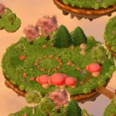

# The Lantern Trail (1.5)

A short 2.5D adventure that continues The Lantern Picnic's story. It takes about 15 minutes and is played at `trail.html`, which you reach from the picnic's title screen. It is built to be light enough for any phone: no WebGL and no 3D models. The map is pre-rendered once from the game's own Blender kit and drawn with the browser's plain 2D canvas.



## The story

The morning after Lantern Night, a little map arrives with Hazel's reply. The friends set off across a lantern bridge to Fernhollow, five floating islets above the clouds. A gust of silver mist scatters them.

Pip has to gather the friends again, calm the lonely mist and light three waystones, so that Hazel's beacon on the summit can guide her home for the next Lantern Night. The friends are found in this order:

| Islet | Who | What happens |
| --- | --- | --- |
| Landing Meadow | Pip alone | Pip arrives over the bridge from the clearing. The first Mistling teaches hugs and the timing ring. The first waystone melts the mist on the bridge. |
| Lily Pond Glade | Momo | Two Mistlings won't let Momo finish her tea. Momo helps calm them and joins, and her tea's steam clears the next bridge. |
| Toadstool Wood | Nori | Nori is cornered in a fairy ring, too proud to ask for help. After the rescue, Nori's kite joins the party and the second waystone wakes. |
| Old Oak Hill | Juniper | Juniper keeps the summit path and asks a riddle (a wrong answer just gets a hint). A Thunder Sulk sits on the last waystone. |
| Beacon Summit | Bramble, Old Fog | Bramble came up alone in the night to keep the beacon company and is hiding behind a rock. Old Fog, lonely since Hazel left, has curled around the beacon. |

Mistlings are not enemies. They are lonely wisps of fog, and calming one turns it into fireflies. You can't lose. If every friend dozes off, everyone wakes by the last lit waystone with full hearts.

Hazel left one note on each islet. Notes are optional, but each one you find lets Pip read Hazel's words to Old Fog in the last battle (7% of its gloom per note).

The ending pays off the picnic's last letter. The beacon blazes, a lantern answers from across the clouds, and Hazel writes: "I'm on my way. Save me a seat on the blanket." An end card shows the friends found, the notes, the Lovely moments and the minutes played. You can return to the picnic or keep wandering.

## Play

- **Walk.** Drag on the left half of a phone's screen (a floating stick), or tap anywhere to walk there. On a computer, use WASD or the arrow keys, or click. A gamepad's left stick also works.
- **Interact.** A big button appears beside anything you can use: read a note or the signpost, open one of Hazel's picnic baskets, light or rest at a waystone, talk to a friend. You can also tap the thing itself, or press E or Space.
- **Battles.** Touch a Mistling to start one. Each friend has four commands, and Pip gets a fifth near the end:

| Command | What it does |
| --- | --- |
| Hug | Calms one Mistling |
| Special | Pip's Lantern Glow calms every Mistling. Momo's Moonflower Tea heals and wakes the party. Nori's Kite Dash calms twice as much and reaches hiding Mistlings. Juniper's Riddle puzzles a Mistling for two turns and shows what it loves. Bramble's Lantern Shield halves the chill for two rounds. Specials then need a few turns to recharge. |
| Fruit | Cherries, strawberries, peaches, a lemon (wakes a friend), watermelon (heals everyone) and Bramble's dragon fruit. A fruit nobody needs stays in the basket. |
| Guard | Halves the chill on that friend this round |
| Hazel's notes | Appears for Pip once Old Fog is worn down to 60%, if at least one note was found |

- **Timing.** When a hug lands, tap as the shrinking ring meets the inner one for a Lovely hug, which calms 1.5× as much. When the mist drifts at a friend, tap as it arrives to brace, which halves the chill. Missing either costs nothing. Settings → Timing help widens both windows.
- **Weak spots.** Each kind of Mistling loves one thing: hugs, lantern light, kites or riddles. A loved move calms 1.6× as much. A Riddle reveals what a Mistling loves, and the tutorial Wisp shows it from the start.
- **Levels.** Calmed Mistlings give glow, and glow raises the whole party's level: more heart (health) and warmth (hug strength). Waystones heal everyone and save the journey. The game also autosaves every few seconds and when you leave the page.

## How it is built

| File | Role |
| --- | --- |
| `src/trail/trail-map.js` | Map data shared by the bake and the runtime: islets, bridges and gates, story spots, keep-clear zones, seeded scenery, the orthographic projection, plate and walk-grid extents |
| `src/trail/trail-rules.js` | Pure rules: party, Mistlings, battles (seeded and deterministic), fruit, levels, goals, saves. `autoplay()` plays whole battles for tests |
| `src/trail/trail-script.js` · `trail-vi.js` · `trail-i18n.js` | Every line of the story in English, and Vietnamese keyed by the English. The language is shared with the picnic's settings |
| `src/trail/trail-grid.js` | Baked heights and walkable cells, one-cell erosion so planned paths fit a body, mist-wall blockers, sliding collision, A* with string pulling |
| `src/trail/trail-stage.js` | The Canvas2D renderer: plate tiles, depth-sorted sprites, procedural Mistlings, koi, butterflies, motes, fireflies, petals, light pools, mist walls, timing rings, the adaptive pixel-ratio governor |
| `src/trail/critters2d.js` | Koi and butterflies from the lightweight-game-objects skill, scaled to world units |
| `src/trail/trail-main.js` | The director: input, exploring, conversations, the battle flow, menus, saves, sound, test hooks |
| `tools/bake-trail/` | The bake (`npm run assets:trail`) |

**The bake** builds Fernhollow in Three.js from the picnic's own Blender libraries. It uses the island, trees, bushes, rocks, ferns, mushrooms, flowers, tufts, pond, basket, post and lantern. Procedural pieces are added on top: rope bridges, stone waystones, the beacon's plinth and a shader cloud sea. The bake renders the scene with the picnic's golden-hour light and post-processing through an **orthographic** camera at a 48° pitch.

Because the projection is orthographic, a prop looks the same anywhere on the map. So each kind of tree or rock is baked once as a sprite and placed many times, and a pixel maps back to the world with two multiplications. The bake writes:

- **`ground-X-Y.webp`:** the plate, in 1024 px tiles at 64 px per world unit. Trees, bushes, rocks and landmarks are invisible in it but still cast their shadows into it.
- **`props.webp`:** one sprite per prop kind and turn, skyline-packed. Canopies are baked at 72 px per unit and everything else at 96. The waystones and the beacon are also baked lit.
- **`cast-NAME.webp`:** 20 poses per friend: idle, walk, talk, wave, cheer, hop and eat facing front-right, and idle and walk facing back. The runtime mirrors them for left.
- **`manifest.json`:** the plate, the sprite rectangles and pivots, every placed prop with its height, the friends' face boxes for portraits, and the walk grid (heights and walkable cells at 0.25 units, base64).
- **`door.webp`:** the postcard on the picnic's title.

**The stage** draws each frame as follows:

1. The visible plate tiles (2 to 4 draws).
2. The koi.
3. Light pools and blob shadows.
4. Props, friends, Mistlings and notes, sorted by depth with an insertion sort.
5. Butterflies, glows, motes, fireflies and particles.
6. Floating words, the timing ring and the battle vignette.

A tree in front of Pip fades to 42% so nobody gets lost behind a canopy.

Mistlings are not baked. Each mood (sad, grumpy, shy, sleepy, puzzled, happy) is painted once into a small canvas at startup. No gradients, blur, filters or allocations happen per frame. The pixel ratio is capped at 2, and the governor lowers it in 0.25 steps when the median frame passes 21 ms.

The build copies `assets/lantern-picnic/trail/` and writes content hashes into its manifest, as it does for the light stage. The stage requests `file?v=hash`, so a deploy never pairs a new manifest with old pictures.

## Measured

These come from the production build (`npm run build`), served gzipped from a project subfolder the way GitHub Pages serves it. The profile is a phone: 390×844 at DPR 3, with touch. A scripted walk lasts about 6 s, then the rules' bot plays a battle at normal speed (the `perf` probe).

| | CPU ×1 | CPU ×4 | CPU ×6 | Software GPU (SwiftShader), CPU ×4 |
| --- | --- | --- | --- | --- |
| To the title (local network) | 0.2 s | 0.3 s | 0.3 s | 0.35 s |
| Frame rate walking / in battle | 60 / 60 fps | 60 / 60 fps | 60 / 60 fps | 60 / 60 fps |
| Canvas work per frame (median, walking) | 0.2 ms | 1.2 ms | 1.5 ms | 1.5 ms |
| Janky frames (> 25 ms) in about 6 s | 0 | 0 | 0–2 | 0 |
| Main-thread stalls while booting | 0.1 s in total | under 0.1 s | under 0.1 s | under 0.1 s |

- **Download:** 1.15 MB in 25 requests, all four friends' sheets included. They stream in after the title appears. That's about half of the picnic's light stage and a sixth of its 3D mode. The Vietnamese text loads only when Vietnamese is chosen.
- **Never downloaded:** Three.js, GLB models and Draco.
- **JS heap:** 10 MB.
- **Draw calls per frame:** about 160 cheap `drawImage` calls with no WebGL.
- **A stall that was fixed:** one portrait made with `toDataURL` had cost 0.9 s on a software GPU, so portraits are now drawn into canvases directly.

## Tests

```sh
npm test                    # includes tests/trail.test.mjs: rules, balance, saves, Vietnamese coverage, bake freshness, map connectivity
npm run dev                 # then:
npm run test:trail          # phone by touch, desktop through the whole story, landscape phone, budgets, save/continue
npm run build && npm run test:pages
```

- **Bake freshness.** After changing `trail-map.js` or the Blender kit, run `npm run assets:trail` (about 20 s on a GPU). The freshness test fails until the baked props match the map data.
- **Balance.** A balance test plays the main story path over 60 seeds with middling timing. It requires at least 90% wins and a boss fight of 6 rounds or more.
- **Connectivity.** Another test walks the baked grid. Every story spot must be reachable once its gates open, and no bridge may open before its gate.

Browser tests use `?debug` hooks (`window.__trail`): teleport, interact, `auto.fast` for quick animations, and `auto.battles` to let the rules' bot choose commands.

## Honest limits

- The friends are flip-book sprites with two facings (mirrored). There is no 8-direction art.
- The map has one baked hour, golden. The ending lights the beacon with additive glows rather than a re-baked night.
- Battle balance comes from a scripted bot, not from playtests with people.
- Audio reuses the picnic's procedural engine (golden palette, babble voices). It has no music written for battles.
